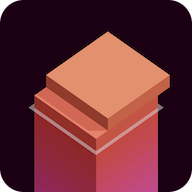

# stack
A Web remake of a popular tower stacking game for mobiles.

  

Just saw [KonradLinkowski/Stack][threejs-version], and decided to rewrite it from Three.js to React Three Fiber.

> It's my first try at games, and the first glance at 3D from a dev's perspective (tried 3ds Max before, that's all).

## Enhancements

> over the [Three.js version][threejs-version]

- Shadows. The lighting almost matches the original iOS game.
- A service worker and `manifest.json`. The game runs offline and can be added to Home Screen as a standalone app.
- Auto-play. It is a dev-only feature that makes the game play itself, with some level of error if required. Essentially, this is an automatic test.
- `pointerDown` instead of `click` event to play. Because that's how it worked in the original game.
- Adapt game size to the user's screen (only based on screen width for now).
- Physics for cut off tiles.
- Orthographic (non-perspective) camera, like in the original game. The point of view (a.k.a. the orthographic equivalent of perspective) also exactly matches the original, double-checked by precise measurements and by overlaying screenshots of the two game versions.

- Fixed some minor bugs that glitched the cut off tile once in a while.

## Plans

See or add yours in [Issues](https://github.com/artginzburg/stack/issues)

[threejs-version]: https://github.com/KonradLinkowski/Stack
