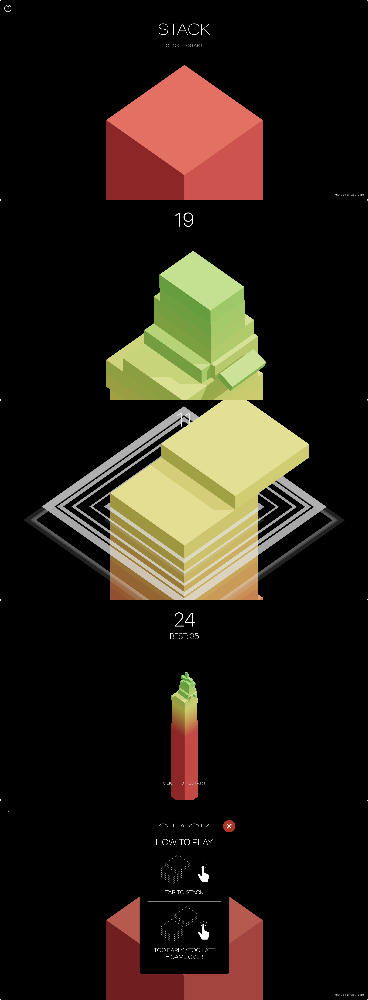

# stack
A Web remake of a popular tower stacking [game][original] for mobiles.

  

Just saw [KonradLinkowski/Stack][threejs-version], and decided to rewrite it from [Three.js][threejs] to [React Three Fiber][r3f].

> It's my first try at games, and the first glance at 3D from a dev's perspective (tried 3ds Max before, that's all).

## Motivation

### Aim

This project aims to be a functionally and visually exact copy of the original game. The intention is to train the reverse design and system architecture skills of the contributors.

### Exceptions

Though, if there's something to improve (i.e. add without disturbing the visual and functional consistency) in the original — it may be an exception. A good example of such  platform-specific capability that adds without modifying the concept is adapting to large screens: as this runs in Web, there's no reason to force the portrait viewport orientation.

Another thing I already implemented is statistics display. I'm almost sure that the original collects some sort of stats to improve the future games of the studio, but there's no way for the player to see their collected stats.

When the theming support is finished, I'd like to add more available customizations for new themes, like the ability to invert gravity (that already exists in dev mode).

## Enhancements

> over the [Three.js version][threejs-version]

- Shadows. The lighting almost matches the original iOS game.
- A service worker and `manifest.json`. The game runs offline and can be added to Home Screen as a standalone app.
- Auto-play. It is a dev-only feature that makes the game play itself, with some level of error if required. Essentially, this is an automatic test.
- `pointerDown` instead of `click` event to play. Because that's how it worked in the original game.
- Adapt game size to the user's screen (only based on screen width for now).
- Physics for cut off tiles.
- Orthographic (non-perspective) camera, like in the original game. The point of view (a.k.a. the orthographic equivalent of perspective) also exactly matches the original, double-checked by precise measurements and by overlaying screenshots of the two game versions.

- Fixed some minor bugs that glitched the cut off tile once in a while.

## Plans

See or add yours in [Issues](https://github.com/artginzburg/stack/issues)

[threejs-version]: https://github.com/KonradLinkowski/Stack
[original]: https://apps.apple.com/us/app/stack/id1080487957
[threejs]: https://threejs.org
[r3f]: https://docs.pmnd.rs/react-three-fiber

